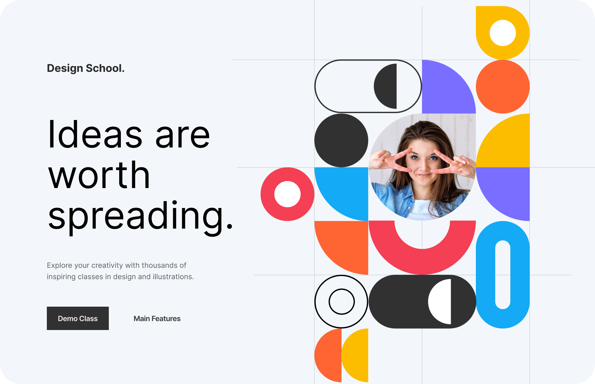

# Figma Projects Portfolio

Welcome to my Figma project repository! 🎨  
Here, I showcase a variety of creative designs I have built using Figma, ranging from website layouts to product concepts.

---

## Featured Projects

### 1. Jewellery Website Design
A sleek and elegant design for a jewellery website, focusing on modern aesthetics and user-friendly navigation.

---

### 2. Modern Educational Website Landing Page
A vibrant and engaging landing page design for an educational platform, highlighting key features and user accessibility.



---                                                                               
### 4. E-Bike Wand
A modern and eco-friendly e-bike concept design that combines technology and sustainability.                                 

## Other Projects

 -**Gaming Console UI Design**
    A futuristic and immersive user interface concept for a gaming console, focused on a modern user experience.

- **Nike Air Shoes Landing Page**  
  A minimalistic and trendy design showcasing Nike Air shoes.

- **Figma 1**  
  Creative design mockups using Figma tools.

- **Figma 2**  
  Another unique and innovative design project.

---
## Practice-Based Projects

These are designs I created to enhance my skills and experiment with new ideas. 
1) Jewellery Website 
A practice-based project exploring the design of an elegant and user-friendly jewellery full-website.

2) Furniture Shop Website Design
A practice-based design concept for an online furniture store, focusing on product showcase,full site and e-commerce experience.

## About This Repository

This repository serves as a portfolio of my Figma design skills. Feel free to explore the projects and provide feedback!
---

## How to View These Designs

1. Clone this repository:
   ```bash
   git clone https://github.com/nikhilpachange/Figma

